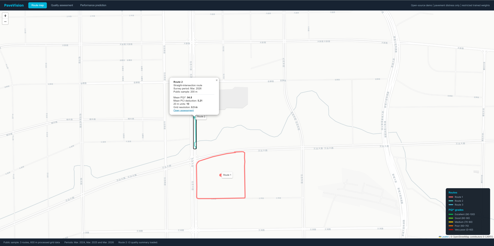
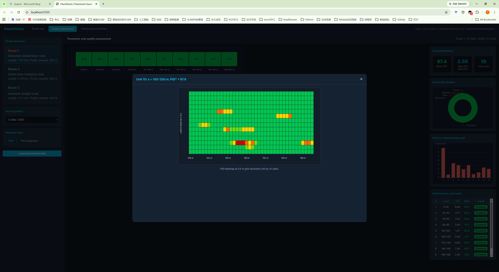
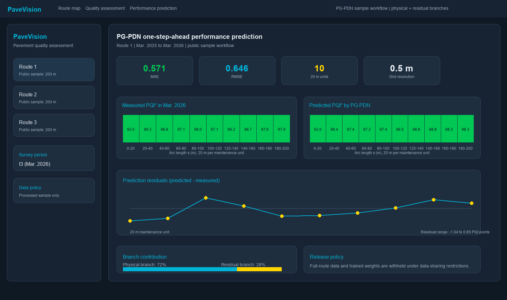
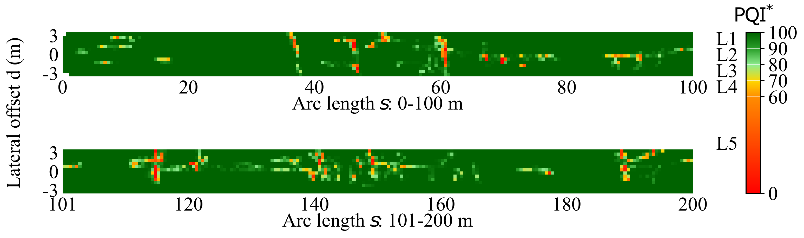
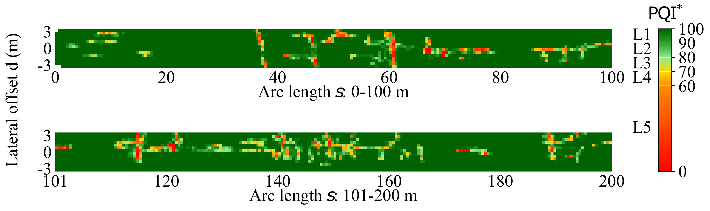
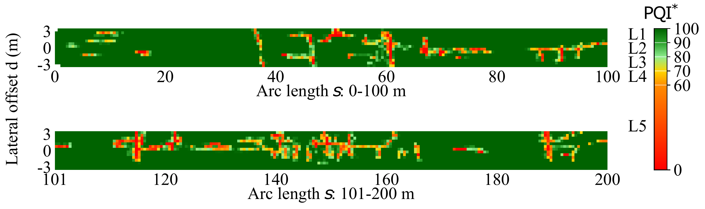
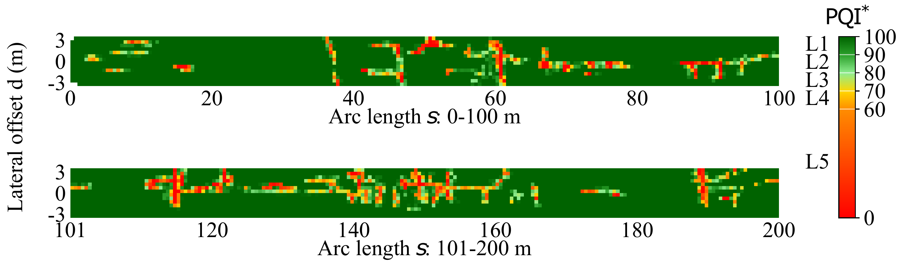
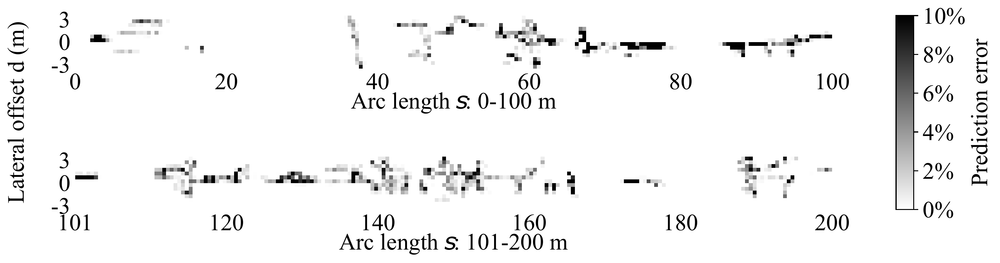

# PaveVision PG-PDN Demonstration Package

This repository accompanies the manuscript "Physics-guided pavement degradation prediction from grid-level semantic distress maps".

The repository is maintained as the public release point for the data, PG-PDN code and PaveVision visualization system associated with the manuscript. It currently provides materials for method inspection, frontend visualization and software reuse, including the PG-PDN architecture, feature schema, loss function, visualization utilities, a browser-based PaveVision demo and processed demonstration records.

## Planned Updates

This repository will be updated continuously as the associated manuscript advances through peer review, acceptance and publication. Additional paper-aligned data, documentation, examples, model resources and reproducibility materials will be uploaded in stages according to the publication status and data-release permissions.

At the current pre-publication stage, the release focuses on materials that support method inspection, interface demonstration and software reuse. The repository will be expanded progressively so that the final public release corresponds to the data availability statement in the accepted paper.

## Update Record

| Date | Uploaded or updated content | Notes |
| --- | --- | --- |
| 2026-06-05 | Updated repository release statement and added this update record. | Clarified that the repository will be updated continuously through review, acceptance and publication. |
| 2026-06-04 | Added PaveVision interface screenshots, PG-PDN architecture illustration and paper-aligned visualization examples. | Supports visual inspection of the route map, quality assessment, performance prediction and grid-level prediction outputs. |
| 2026-06-03 | Added the public PaveVision web demo, PG-PDN inference package, configuration template, example scripts and demonstration data files. | Provides a staged public release for method inspection and software reuse before manuscript acceptance. |
| Planned after acceptance | Paper-aligned data release, additional reproducibility materials and any final model or visualization resources approved for public sharing. | The final repository state will be aligned with the accepted manuscript. |

## PaveVision Interface Preview

PaveVision is a pavement quality assessment and performance-prediction interface built around semantic distress maps and grid-level PG-PDN outputs. The screenshots below are captured from the local PaveVision system; the current public repository provides the same frontend layout in `web_demo/` and serves precomputed demonstration outputs for browser-based inspection.

### Route Map and Quality Popup

The route-map view provides the first entry point for pavement engineers. The preview keeps the Chinese basemap used in the local system because it better matches the visible road network around the GPS traces. Clicking a route opens a quality summary popup with the survey period, public sample length, mean PQI*, distress deduction, number of 20 m maintenance units and 0.5 m grid resolution.



### Pavement Quality Assessment



### Performance Prediction



### PG-PDN Network Architecture

The PG-PDN architecture combines an interpretable physical degradation branch with a GRU residual correction branch. This public package keeps the model interface, feature schema, loss terms and visualization workflow consistent with the manuscript; additional paper-aligned resources will be uploaded according to the staged release plan.


### Historical Measurements and PG-PDN Prediction at 0.5 m Resolution

The fig10 series visualizes Route 3 at 0.5 m grid resolution: March 2024 measured quality, March 2025 measured quality, March 2026 PG-PDN prediction, March 2026 measured quality and the prediction residual. These images illustrate measured-to-predicted spatial continuity rather than a comparison among different learning algorithms.

#### March 2024 Measured



#### March 2025 Measured



#### March 2026 Predicted



#### March 2026 Measured



#### Prediction Residual



## What Is Included

- `web_demo/`: Flask-based public PaveVision frontend demo using precomputed 600 m sample outputs.
- `pgpdn/`: lightweight Python implementation of the PG-PDN inference architecture.
- `configs/pgpdn_default.yaml`: architecture and physical-parameter defaults reported in the manuscript.
- `examples/`: runnable examples using synthetic data only.
- `sample_data/`: small synthetic feature tables for checking input/output formats.
- `web_demo/data/sample/`: processed public sample JSON files aligned with the manuscript route definitions, survey periods and 0.5 m visualization workflow.
- `supplementary/`: method notes, data-release statement and figure-generation guidance.

## Current Staged Release Notes

The pre-acceptance release is intentionally staged. Detailed survey materials, full-route feature tables, final trained model resources and restricted training or inference assets may be added only after manuscript acceptance and data-release approval. The web demo currently serves precomputed demonstration outputs and simplified display polylines for route visualization.

## Feature Schema

Each grid cell is represented by the 12-dimensional feature vector used in the manuscript:

```text
[PQI*, ESAL, P, DeltaT, F, D1, D2, D3, D4, I_mean, I_std, I_low]
```

where `PQI*` is the current grid-level pavement quality index, `ESAL` is expressed in units of 10^4, `P` is precipitation in mm, `DeltaT` is the mean daily temperature range in degrees Celsius, `F` is the number of low-temperature days with mean daily temperature below 0 degC, `D1`--`D4` are distress densities for transverse cracks, longitudinal cracks, alligator cracks and potholes, and `I_mean`, `I_std`, `I_low` are LiDAR intensity features.

## Quick Start

Run the public PaveVision web demo:

```bash
python -m pip install -r web_demo/requirements.txt
python web_demo/app.py
```

On Windows, the one-click launcher can be used from the repository root:

```bat
run_web_demo.bat
```

Then open:

```text
http://localhost:5000
```

The web demo's prediction button currently loads precomputed PG-PDN demonstration outputs from `web_demo/data/sample/`. Additional executable and data resources will be added according to the staged release plan.

For the Python PG-PDN architecture examples, install the minimal modeling dependencies:

```bash
pip install -r requirements.txt
```

Run the synthetic inference example:

```bash
python examples/run_inference_template.py --features sample_data/synthetic_grid_features.csv
```

Generate a synthetic quality-map preview:

```bash
python examples/plot_synthetic_quality_map.py --features sample_data/synthetic_grid_features.csv --output outputs/synthetic_quality_map.png
```

The default model uses initialized physical parameters and random neural weights. The numerical outputs are not calibrated predictions; they are provided only to verify the architecture and data flow.

## Citation

Please cite the associated manuscript if you use this code or adapt the PG-PDN architecture.
