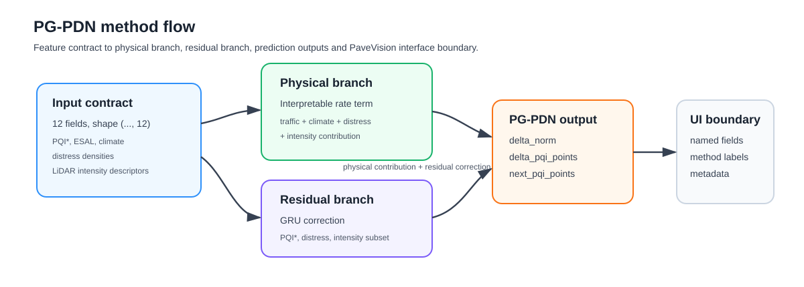
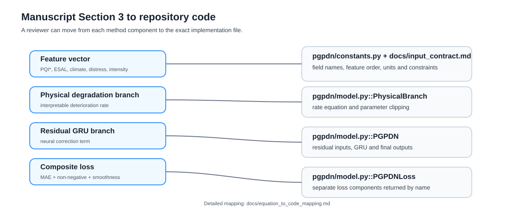
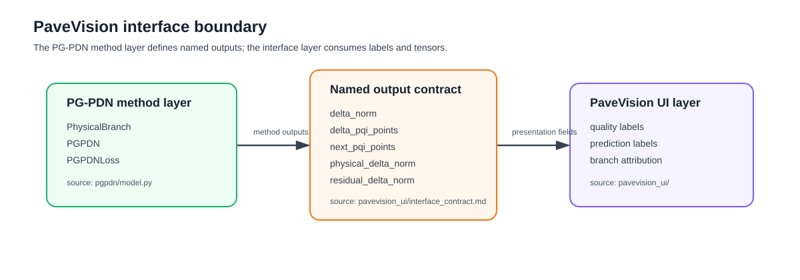

# pavevision-pgpdn-demo

PG-PDN method package for PaveVision.

Last updated: 2026-07-06 11:24 (Asia/Shanghai).

[](LICENSE)
[](pyproject.toml)
[](pgpdn/model.py)
[](docs/equation_to_code_mapping.md)

This repository accompanies the manuscript **"Physics-guided pavement degradation prediction from grid-level semantic distress maps"**.

It provides the source-level implementation of **PG-PDN**, a physics-guided pavement degradation prediction network that links grid-level pavement quality assessment with method-level deterioration prediction. The repository is organized for reviewers and readers who want to inspect the model design, feature contract, physical branch, residual branch, loss terms and manuscript-to-code mapping without needing to read the entire codebase first.

## Research Lineage

This repository is the prediction-method layer in a pavement digitalization workflow. It builds on two preceding open-source projects from the same research line:

| Stage | Repository | Role in the research line |
| --- | --- | --- |
| 3D pavement representation | [pavement-3d-reconstruction](https://github.com/GanghaoSun/pavement-3d-reconstruction) | Upstream pavement 3D reconstruction foundation. |
| Distress map representation | [pavement-distress-semantic-map](https://github.com/GanghaoSun/pavement-distress-semantic-map) | Upstream semantic distress-map representation. |
| Degradation prediction | [pavevision-pgpdn-demo](https://github.com/GanghaoSun/pavevision-pgpdn-demo) | PG-PDN method implementation, configuration and interface contract. |

## At a Glance

| Asset | What a reviewer can inspect |
| --- | --- |
| PG-PDN architecture | Physical degradation branch, GRU residual branch and prediction outputs in [pgpdn/model.py](pgpdn/model.py). |
| Feature contract | 12 required fields, tensor shape, units and constraints in [docs/input_contract.md](docs/input_contract.md). |
| Physical branch | Engineering-parameterized deterioration-rate equation with parameter clipping. |
| Residual branch | GRU correction using current quality, distress densities and LiDAR intensity descriptors. |
| Composite objective | MAE term, non-negative deterioration penalty and along-route smoothness penalty. |
| Method configuration | Default dimensions, physical parameters and loss weights in [configs/pgpdn_default.yaml](configs/pgpdn_default.yaml). |
| Code traceability | Section 3 equation-to-code map in [docs/equation_to_code_mapping.md](docs/equation_to_code_mapping.md). |
| PaveVision boundary | UI-facing output contract in [pavevision_ui/](pavevision_ui/). |

## Visual Overview

### PG-PDN Network Architecture


PG-PDN combines an interpretable physical branch with a residual learning branch. The physical branch encodes traffic, climate, distress and intensity effects, while the GRU residual branch corrects the remaining nonlinear degradation signal.

### Method Flow



The method package is organized around a direct flow from feature contract to branch computation, deterioration prediction and UI-facing outputs.

### Section 3 to Code



Each major manuscript method component is mapped to concrete files so that non-code readers can quickly see where the method is implemented.

### PaveVision Interface Boundary



The PaveVision layer is represented as a source boundary: the model layer defines named outputs, and the interface layer consumes those outputs without redefining the PG-PDN method.

## Reviewer Reading Path

| Time | Goal | Start here | What to look for |
| ---: | --- | --- | --- |
| 2 min | Understand the repository scope | [docs/method_scope.md](docs/method_scope.md) | What is implemented and how the package is organized. |
| 5 min | Trace the method | [docs/equation_to_code_mapping.md](docs/equation_to_code_mapping.md) | Where each Section 3 equation, branch and loss term appears in code. |
| 5 min | Inspect required inputs | [docs/input_contract.md](docs/input_contract.md) | Field names, tensor shape, units and constraints. |
| 10 min | Read the core implementation | [pgpdn/model.py](pgpdn/model.py) | `PhysicalBranch`, `PGPDN` and `PGPDNLoss`. |
| 10 min | Inspect configuration | [configs/pgpdn_default.yaml](configs/pgpdn_default.yaml) | Dimensions, initial physical parameters and loss weights. |
| 5 min | Inspect UI boundary | [pavevision_ui/interface_contract.md](pavevision_ui/interface_contract.md) | Output names expected by the PaveVision presentation layer. |

## What This Repository Provides

| Path | Purpose |
| --- | --- |
| [pgpdn/model.py](pgpdn/model.py) | Implements `PhysicalBranch`, `PGPDN` and `PGPDNLoss`. |
| [pgpdn/constants.py](pgpdn/constants.py) | Defines PG-PDN feature names and default physical-branch parameters. |
| [pgpdn/features.py](pgpdn/features.py) | Validates the PG-PDN input contract and exports the feature tensor order. |
| [configs/pgpdn_default.yaml](configs/pgpdn_default.yaml) | Records model dimensions, parameter defaults and loss coefficients. |
| [docs/equation_to_code_mapping.md](docs/equation_to_code_mapping.md) | Maps manuscript Section 3 concepts to source code. |
| [docs/input_contract.md](docs/input_contract.md) | Documents field names, shapes, units and constraints. |
| [docs/method_scope.md](docs/method_scope.md) | Defines the package scope and method boundary. |
| [docs/manuscript_mapping.md](docs/manuscript_mapping.md) | Provides a compact manuscript-to-repository index. |
| [pavevision_ui/](pavevision_ui/) | Documents the UI-facing method-output boundary. |
| [supplementary/](supplementary/) | Provides concise supplementary notes for method inspection. |
| [CITATION.cff](CITATION.cff) | Citation metadata for GitHub and reference managers. |

## Method Modules

### 1. Feature Contract

Each grid cell is represented by the 12-dimensional PG-PDN feature vector:

```text
[PQI*, ESAL, P, DeltaT, F, D1, D2, D3, D4, I_mean, I_std, I_low]
```

The corresponding Python field names are:

```text
pqi_star, esal_1e4, precip_mm, temp_range_c, low_temp_days,
density_transverse, density_longitudinal, density_alligator, density_pothole,
intensity_mean, intensity_std, intensity_low_prop
```

The model accepts tensors with final dimension `12`; complete field constraints are listed in [docs/input_contract.md](docs/input_contract.md).

### 2. Physical Branch

The physical branch is implemented by `PhysicalBranch` in [pgpdn/model.py](pgpdn/model.py). Its parameter order is:

```text
alpha0, alpha1, alpha2, alpha3, alpha4,
beta1, beta2, beta3, beta4, gamma
```

The branch combines traffic loading, precipitation, temperature range, low-temperature days, four distress densities and the LiDAR intensity term. Parameters are clipped around their initial values according to [configs/pgpdn_default.yaml](configs/pgpdn_default.yaml).

### 3. Residual Branch

`PGPDN.residual_inputs()` constructs the residual-branch tensor:

```text
[normalized PQI*, D1, D2, D3, D4, I_mean, I_std, I_low]
```

The residual tensor is passed to a single-layer GRU and a linear head to produce `residual_delta_norm`.

### 4. Prediction Outputs

`PGPDN.forward()` returns named tensors:

| Output key | Meaning |
| --- | --- |
| `delta_norm` | Predicted normalized deterioration. |
| `delta_pqi_points` | Predicted deterioration in PQI* points. |
| `next_pqi_points` | Predicted next-period PQI*, clipped to `[0, 100]`. |
| `physical_rate` | Non-negative physical deterioration rate. |
| `physical_delta_norm` | Physical-branch contribution in normalized units. |
| `residual_delta_norm` | GRU residual correction in normalized units. |

### 5. Composite Objective

`PGPDNLoss` exposes the three training-objective components:

```text
loss = MAE(predicted deterioration, target deterioration)
     + lambda_neg * nonnegative-deterioration penalty
     + lambda_smooth * along-route smoothness penalty
```

Default coefficients:

| Coefficient | Default | Source |
| --- | ---: | --- |
| `lambda_neg` | `0.5` | [configs/pgpdn_default.yaml](configs/pgpdn_default.yaml) |
| `lambda_smooth` | `0.1` | [configs/pgpdn_default.yaml](configs/pgpdn_default.yaml) |

## Section 3 Mapping

| Manuscript component | Repository implementation |
| --- | --- |
| Feature vector construction | [pgpdn/constants.py](pgpdn/constants.py), [docs/input_contract.md](docs/input_contract.md) |
| Physical deterioration rate | [pgpdn/model.py](pgpdn/model.py) `PhysicalBranch.forward()` |
| Parameter initialization | [pgpdn/constants.py](pgpdn/constants.py), [configs/pgpdn_default.yaml](configs/pgpdn_default.yaml) |
| Parameter clipping | [pgpdn/model.py](pgpdn/model.py) `PhysicalBranch.clipped_theta()` |
| Residual input subset | [pgpdn/model.py](pgpdn/model.py) `PGPDN.residual_inputs()` |
| GRU residual correction | [pgpdn/model.py](pgpdn/model.py) `PGPDN.forward()` |
| Final deterioration output | [pgpdn/model.py](pgpdn/model.py) `PGPDN.forward()` |
| Composite loss | [pgpdn/model.py](pgpdn/model.py) `PGPDNLoss.forward()` |

For the complete mapping, see [docs/equation_to_code_mapping.md](docs/equation_to_code_mapping.md).

## Repository Structure

```text
.
|-- README.md
|-- CHANGELOG.md
|-- CITATION.cff
|-- LICENSE
|-- assets/
|   |-- pgpdn_architecture.png
|   |-- pgpdn_method_flow.svg
|   |-- section3_code_map.svg
|   `-- pavevision_interface_boundary.svg
|-- configs/
|   `-- pgpdn_default.yaml
|-- docs/
|   |-- equation_to_code_mapping.md
|   |-- input_contract.md
|   |-- manuscript_mapping.md
|   |-- method_scope.md
|   `-- public_workflow.md
|-- pavevision_ui/
|   |-- README.md
|   `-- interface_contract.md
|-- pgpdn/
|   |-- constants.py
|   |-- features.py
|   |-- model.py
|   |-- visualization.py
|   `-- __init__.py
`-- supplementary/
    |-- Data_and_Model_Release_Statement.md
    `-- Supplementary_Methods.md
```

## Method Inspection Checklist

| Question | Where to verify |
| --- | --- |
| What are the required input fields? | [docs/input_contract.md](docs/input_contract.md) |
| Where is the physical branch implemented? | [pgpdn/model.py](pgpdn/model.py), `PhysicalBranch` |
| Where is the GRU residual branch implemented? | [pgpdn/model.py](pgpdn/model.py), `PGPDN` |
| Where are the loss terms implemented? | [pgpdn/model.py](pgpdn/model.py), `PGPDNLoss` |
| Where are default coefficients recorded? | [configs/pgpdn_default.yaml](configs/pgpdn_default.yaml) |
| Where is the paper-to-code mapping? | [docs/equation_to_code_mapping.md](docs/equation_to_code_mapping.md) |
| How does PaveVision consume method outputs? | [pavevision_ui/interface_contract.md](pavevision_ui/interface_contract.md) |

## Update Record

| Date | Updated content | Notes |
| --- | --- | --- |
| 2026-07-06 | Restored a richer reviewer-facing README while keeping the repository focused on PG-PDN method coverage. | Added method diagrams, research-lineage links, visual overview, module explanations, Section 3 mapping and a method inspection checklist. |
| 2026-07-06 | Added method-scope documentation, input contract and equation-to-code mapping. | The repository now foregrounds method implementation, configuration and interface definitions. |
| 2026-06-28 | Reorganized the project homepage and supporting documentation for reviewer-facing inspection. | Earlier public-facing README structure provided the baseline for the richer homepage restored here. |

See [CHANGELOG.md](CHANGELOG.md) for the complete update history.

## Citation and License

Please cite the associated manuscript if you use this code or adapt the PG-PDN architecture. Citation metadata are provided in [CITATION.cff](CITATION.cff).

This repository is released under the [MIT License](LICENSE).
