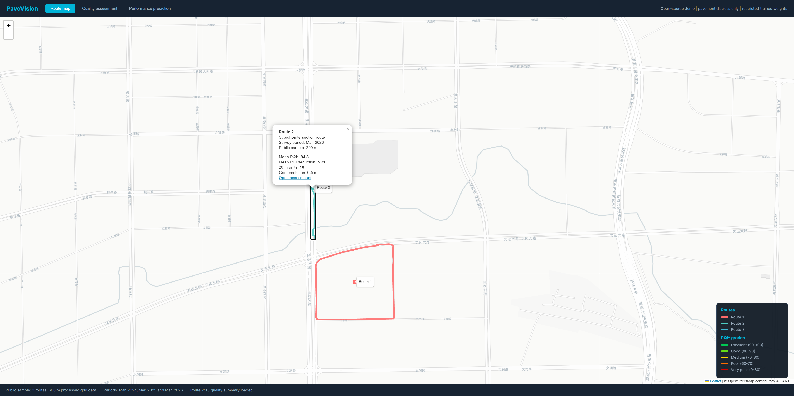
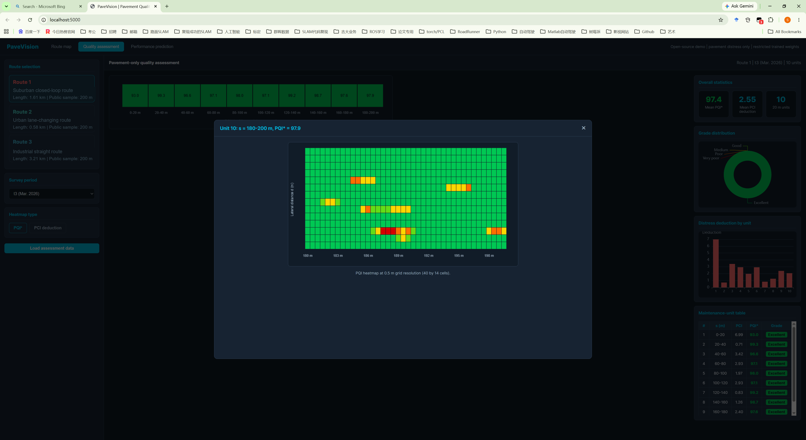
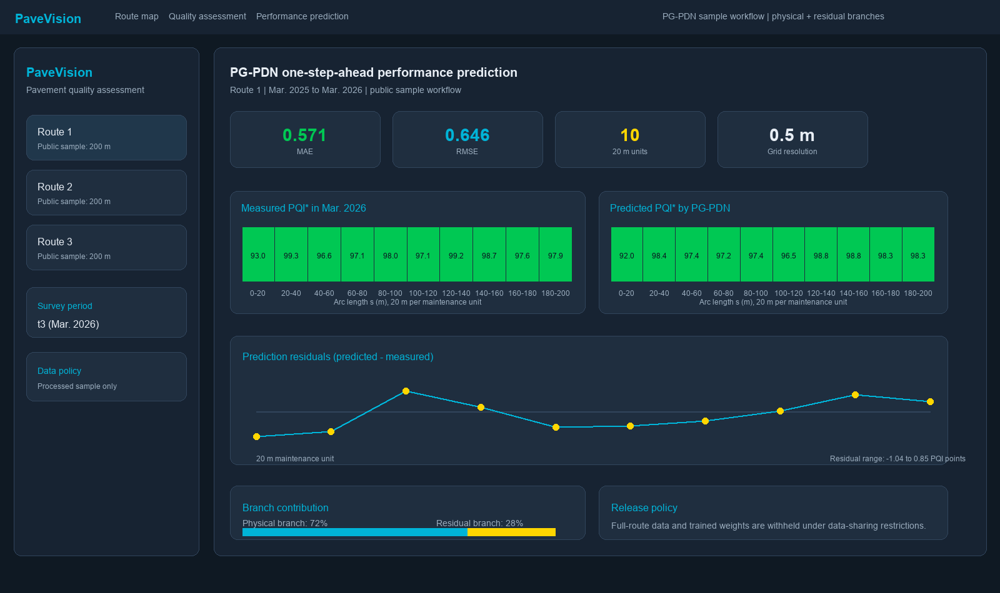
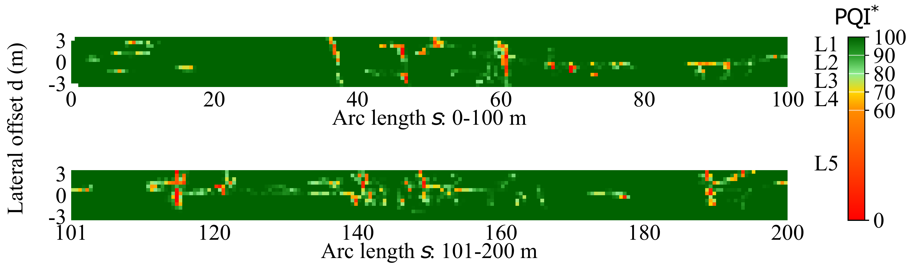
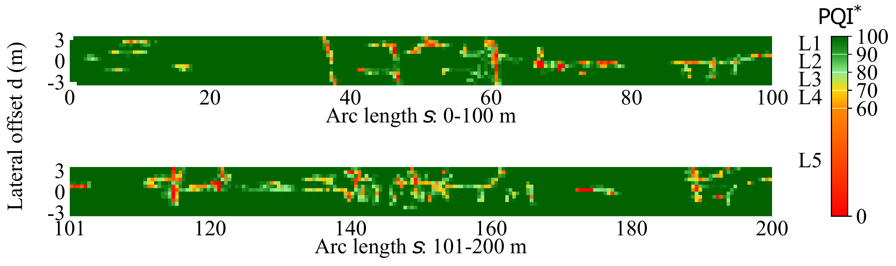
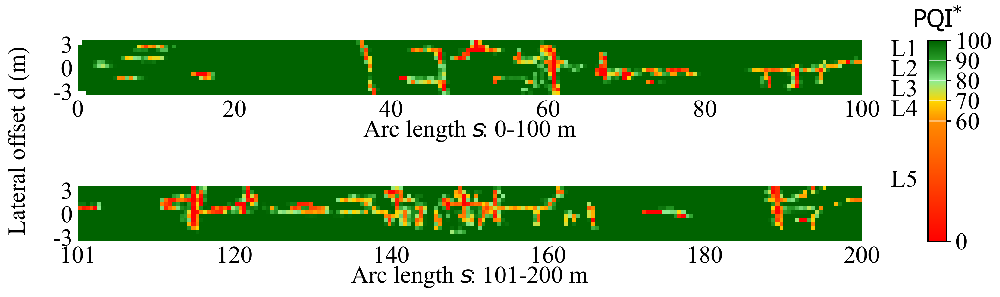
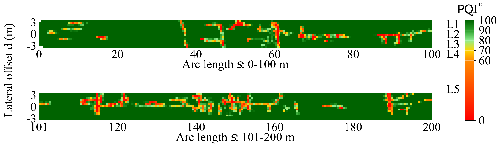
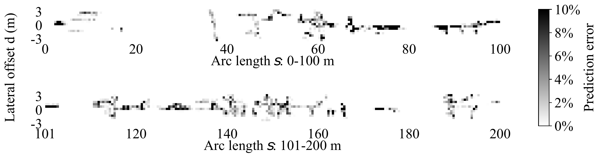

# PaveVision PG-PDN Demonstration Package

Last updated: 2026-07-06 15:03 (Asia/Shanghai).

[](https://github.com/GanghaoSun/pavevision-pgpdn-demo/actions/workflows/ci.yml)
[](LICENSE)
[](pyproject.toml)
[](web_demo/)
[](web_demo/data/sample/manifest.json)
[](docs/equation_to_code_mapping.md)

This repository accompanies the manuscript **"Physics-guided pavement degradation prediction from grid-level semantic distress maps"**.

It provides a public, runnable software package for inspecting the PG-PDN model interface, the PaveVision browser workflow, route-level processed pavement quality outputs, grid-level visualization examples and the manuscript-to-code mapping. The repository is organized so that a reader can review the method visually, run the web system locally, inspect the data schema, execute the model architecture on a synthetic feature table and verify the public package with automated tests.

## At a Glance

| Item | What is provided |
| --- | --- |
| Method | Physics-guided pavement degradation prediction network (PG-PDN) with a physical degradation branch and a GRU residual correction branch. |
| Web system | Flask-based PaveVision interface for route maps, pavement quality assessment and one-step-ahead performance prediction. |
| Route package | Three processed routes, three survey periods, 0.5 m grid visualizations and 20 m maintenance-unit summaries. |
| Prediction outputs | Included PG-PDN route prediction outputs used by the browser prediction view. |
| Code checks | Unit tests for package imports, model tensor outputs, API endpoints, data manifest consistency and public-facing text. |
| Documentation | Public workflow guide, data schema, Section 3 equation-to-code mapping, input contract, supplementary method notes, changelog and citation metadata. |
| UI boundary | PaveVision UI source skeleton documenting how method outputs are consumed by the presentation layer. |

## Reviewer Walkthrough

The repository can be reviewed at three levels, depending on how much code the reader wants to run.

| Review path | Time | What to inspect | Entry points |
| --- | ---: | --- | --- |
| Visual review | 1-3 min | PaveVision interface screenshots, PG-PDN architecture and manuscript-style grid figures. | [Visual Overview](#visual-overview), [assets/](assets/) |
| Browser review | 3-5 min | Route map, quality assessment panel, maintenance-unit view, grid heatmap and prediction panel. | [Quick Start](#quick-start), [web_demo/](web_demo/) |
| Code review | 5-10 min | Feature schema, PG-PDN forward pass, physical branch, residual branch and loss terms. | [pgpdn/model.py](pgpdn/model.py), [pgpdn/features.py](pgpdn/features.py), [configs/pgpdn_default.yaml](configs/pgpdn_default.yaml) |
| Reproducibility checks | 2-5 min | Import checks, model output shapes, API responses and manifest consistency. | [tests/](tests/), [docs/public_workflow.md](docs/public_workflow.md) |
| Manuscript mapping | 2-5 min | Where each manuscript concept appears in this repository. | [docs/manuscript_mapping.md](docs/manuscript_mapping.md), [docs/equation_to_code_mapping.md](docs/equation_to_code_mapping.md) |
| Input contract | 2-5 min | Field names, tensor shapes, units and constraints for PG-PDN inputs and outputs. | [docs/input_contract.md](docs/input_contract.md) |

## Visual Overview

PaveVision is a pavement quality assessment and performance-prediction interface built around semantic distress maps, grid-level pavement quality outputs and PG-PDN degradation prediction.

### Route Map and Quality Popup

The route-map view is the first inspection layer. It displays the processed route geometry, route scenario and a quality popup with the survey period, route length, mean PQI*, distress deduction, number of 20 m maintenance units and 0.5 m grid resolution.



### Pavement Quality Assessment

The quality assessment module provides route-level and maintenance-unit-level views. It links the processed JSON assessment files with continuous-gradient grid heatmaps and summary indicators for pavement condition.



### Performance Prediction

The prediction module compares the previous-period condition, PG-PDN prediction and measured follow-up condition at the route and maintenance-unit levels. Residual views help readers inspect the spatial pattern of prediction errors.



### PG-PDN Network Architecture

PG-PDN combines an interpretable physical degradation branch with a GRU residual correction branch. The public model interface keeps the feature order, output tensors, physical parameters and composite loss terms aligned with the manuscript description.


### Manuscript-Style Grid Figures

The following Route 3 figures show the 0.5 m grid-level visualization sequence used to inspect measured quality, predicted quality and residual structure.

| March 2024 measured | March 2025 measured |
| --- | --- |
|  |  |

| March 2026 PG-PDN prediction | March 2026 measured |
| --- | --- |
|  |  |

| Prediction residual |
| --- |
|  |

## What This Repository Provides

| Path | Purpose |
| --- | --- |
| [web_demo/](web_demo/) | Flask-based PaveVision web system serving processed pavement quality JSON files and included PG-PDN route prediction outputs. |
| [web_demo/data/sample/](web_demo/data/sample/) | Processed assessment and grid JSON files for the public route package. |
| [pgpdn/](pgpdn/) | Lightweight Python implementation of the PG-PDN architecture, feature validation utilities and plotting helpers. |
| [configs/pgpdn_default.yaml](configs/pgpdn_default.yaml) | Architecture, physical-branch and loss defaults used by the public package. |
| [examples/](examples/) | Runnable scripts for schema validation, model-interface inspection and synthetic map generation. |
| [sample_data/synthetic_grid_features.csv](sample_data/synthetic_grid_features.csv) | Synthetic feature table for checking input and output formats. |
| [assets/](assets/) | PaveVision screenshots, PG-PDN architecture illustration and manuscript-style grid visualizations. |
| [docs/](docs/) | Public workflow, data schema, method scope, input contract and Section 3 equation-to-code mapping. |
| [pavevision_ui/](pavevision_ui/) | Source skeleton for the PaveVision UI-facing method-output contract. |
| [supplementary/](supplementary/) | Supplementary method notes for the public package. |
| [tests/](tests/) | Automated checks for the public package. |
| [CITATION.cff](CITATION.cff) | Citation metadata for GitHub and reference managers. |

## Route Package

The PaveVision web demo reads processed JSON files from [web_demo/data/sample/](web_demo/data/sample/). The manifest records the route count, generated files and total processed route length.

| Property | Value |
| --- | --- |
| Number of routes | 3 |
| Route scenarios | Suburban closed-loop, urban lane-changing and industrial straight |
| Survey periods | t1 (Mar. 2024), t2 (Mar. 2025), t3 (Mar. 2026) |
| Total processed route length | 5,401.3 m |
| Grid resolution | 0.5 m |
| Maintenance-unit length | 20 m |
| JSON files listed by manifest | 24 |

See [docs/data_schema.md](docs/data_schema.md) for the CSV and JSON schema details.

## Quick Start

### 1. Run the PaveVision Web Demo

Install the web dependency and start the Flask service:

```bash
python -m pip install -r web_demo/requirements.txt
python web_demo/app.py
```

On Windows, the launcher can be used from the repository root:

```bat
run_web_demo.bat
```

Open:

```text
http://localhost:5000
```

Expected terminal startup text includes:

```text
PaveVision Web System
  Mode: PG-PDN prediction
  Open: http://localhost:5000
```

### 2. Run Public Package Checks

Install the modeling dependencies:

```bash
python -m pip install -r requirements.txt
```

Run the automated checks:

```bash
python -m unittest discover -s tests
```

Expected summary:

```text
Ran 5 tests

OK
```

### 3. Run the Synthetic PG-PDN Interface Example

```bash
python examples/run_inference_template.py --features sample_data/synthetic_grid_features.csv
```

Expected output includes:

```text
Wrote demonstration predictions to outputs/synthetic_predictions.csv
These outputs use initialized parameters for interface inspection.
```

The synthetic example verifies the feature schema, constructs a PG-PDN model instance and writes demonstration predictions for interface inspection.

### 4. Generate a Synthetic Quality-Map Preview

```bash
python examples/plot_synthetic_quality_map.py --features sample_data/synthetic_grid_features.csv --output outputs/synthetic_quality_map.png
```

The generated image checks the grid plotting helper used by the public visualization workflow.

## Web Demo API

The Flask service exposes the same data used by the browser interface. These endpoints are useful for reviewers who prefer to inspect JSON directly.

| Endpoint | Purpose |
| --- | --- |
| `/api/config` | Route definitions, period labels and interface configuration. |
| `/api/assessment/<route_id>/<period_id>` | Route-level and 20 m maintenance-unit assessment summary. |
| `/api/grid/<route_id>/<period_id>?grid_size=0.5` | Grid-level quality values for the selected route and period. |
| `/api/prediction/<route_id>` | PG-PDN prediction summary, baseline, follow-up condition and residual metrics. |
| `/api/grid/prediction/<route_id>?grid_size=0.5` | Grid-level prediction output for the selected route. |
| `/api/traffic?route_id=<route_id>` | Route-specific equivalent standard axle load information used by the interface. |
| `/api/weather` | Weather summary used by the interface. |
| `/api/model_params` | Published physical-branch parameters and loss weights shown in the prediction view. |

Valid route IDs are `route1`, `route2` and `route3`. Valid period IDs are `t1`, `t2` and `t3`.

## PG-PDN Model Interface

Each grid cell is represented by the 12-dimensional feature vector used in the manuscript:

```text
[PQI*, ESAL, P, DeltaT, F, D1, D2, D3, D4, I_mean, I_std, I_low]
```

The Python column names are:

```text
pqi_star, esal_1e4, precip_mm, temp_range_c, low_temp_days,
density_transverse, density_longitudinal, density_alligator, density_pothole,
intensity_mean, intensity_std, intensity_low_prop
```

The model forward pass in [pgpdn/model.py](pgpdn/model.py) returns:

| Output key | Meaning |
| --- | --- |
| `delta_norm` | Predicted normalized deterioration. |
| `delta_pqi_points` | Predicted deterioration in PQI* points. |
| `next_pqi_points` | Predicted next-period PQI* clipped to `[0, 100]`. |
| `physical_rate` | Nonnegative deterioration rate from the physical branch. |
| `physical_delta_norm` | Physical-branch contribution to normalized deterioration. |
| `residual_delta_norm` | GRU residual correction in normalized units. |

The composite loss implementation in [pgpdn/model.py](pgpdn/model.py) exposes the prediction error, nonnegative deterioration penalty and maintenance-unit smoothness term used by the public model interface.

For a line-by-line method trace, see [docs/equation_to_code_mapping.md](docs/equation_to_code_mapping.md). For the complete input and output contract, see [docs/input_contract.md](docs/input_contract.md). For package scope and the PaveVision UI boundary, see [docs/method_scope.md](docs/method_scope.md) and [pavevision_ui/interface_contract.md](pavevision_ui/interface_contract.md).

## Manuscript-to-Repository Mapping

| Manuscript component | Repository files |
| --- | --- |
| PG-PDN feature vector | [pgpdn/constants.py](pgpdn/constants.py), [pgpdn/features.py](pgpdn/features.py), [docs/data_schema.md](docs/data_schema.md) |
| Physical degradation branch | [pgpdn/model.py](pgpdn/model.py), [configs/pgpdn_default.yaml](configs/pgpdn_default.yaml) |
| GRU residual branch | [pgpdn/model.py](pgpdn/model.py) |
| Composite loss terms | [pgpdn/model.py](pgpdn/model.py), [configs/pgpdn_default.yaml](configs/pgpdn_default.yaml) |
| Section 3 equation-to-code mapping | [docs/equation_to_code_mapping.md](docs/equation_to_code_mapping.md) |
| PG-PDN input and output contract | [docs/input_contract.md](docs/input_contract.md) |
| Method scope and UI boundary | [docs/method_scope.md](docs/method_scope.md), [pavevision_ui/](pavevision_ui/) |
| Synthetic model-interface check | [examples/run_inference_template.py](examples/run_inference_template.py), [sample_data/synthetic_grid_features.csv](sample_data/synthetic_grid_features.csv) |
| Grid-level visualization | [pgpdn/visualization.py](pgpdn/visualization.py), [examples/plot_synthetic_quality_map.py](examples/plot_synthetic_quality_map.py) |
| PaveVision route map | [web_demo/static/index.html](web_demo/static/index.html), [web_demo/app.py](web_demo/app.py), [web_demo/data/route_display.json](web_demo/data/route_display.json) |
| PaveVision quality assessment | [web_demo/app.py](web_demo/app.py), [web_demo/data/sample/](web_demo/data/sample/) |
| PaveVision prediction view | [web_demo/app.py](web_demo/app.py), [web_demo/data/sample/](web_demo/data/sample/) |
| Manuscript-style visualizations | [assets/](assets/) |
| Public package checks | [tests/](tests/), [.github/workflows/ci.yml](.github/workflows/ci.yml) |

## Repository Structure

```text
.
|-- README.md
|-- CHANGELOG.md
|-- CITATION.cff
|-- LICENSE
|-- configs/
|   `-- pgpdn_default.yaml
|-- pgpdn/
|   |-- constants.py
|   |-- features.py
|   |-- model.py
|   `-- visualization.py
|-- examples/
|   |-- run_inference_template.py
|   `-- plot_synthetic_quality_map.py
|-- sample_data/
|   `-- synthetic_grid_features.csv
|-- web_demo/
|   |-- app.py
|   |-- static/index.html
|   `-- data/
|-- assets/
|-- docs/
|   |-- equation_to_code_mapping.md
|   |-- input_contract.md
|   |-- method_scope.md
|   |-- manuscript_mapping.md
|   |-- public_workflow.md
|   `-- data_schema.md
|-- pavevision_ui/
|   |-- README.md
|   `-- interface_contract.md
|-- supplementary/
|-- tests/
`-- .github/workflows/ci.yml
```

## Quality Checks

The public test suite in [tests/test_public_package.py](tests/test_public_package.py) checks documentation text, synthetic feature validation, PG-PDN tensor outputs, Flask API endpoints, manifest consistency and route labels. GitHub Actions runs the same public checks through [CI](.github/workflows/ci.yml).

## Update Record

| Date | Uploaded or updated content | Notes |
| --- | --- | --- |
| 2026-07-06 | Restored the full rich README, Web demo package, sample data, screenshots, tests and CI while retaining the new Section 3 method-coverage documentation. | This version combines the reviewer-facing visual homepage from `b9a06ca` with the newer equation-to-code mapping, input contract, method scope and PaveVision UI boundary. |
| 2026-06-28 | Rewrote the README as a reviewer-facing project homepage with richer visual guidance, quick-start checks, API documentation, repository structure and manuscript-to-code mapping. | The main page now emphasizes the materials that are available, runnable and inspectable in this repository. |
| 2026-06-28 | Refined the public release narrative, added documentation pages, CI tests, citation metadata and changelog, and aligned web-demo model descriptions with the included PG-PDN route outputs. | Public pages focus on the available software, data interfaces and verification workflow. |
| 2026-06-07 | Updated the PaveVision web system to the processed pavement quality data for all three routes, about 5.40 km in total, PG-PDN prediction outputs and per-route baseline comparison, refreshed interface screenshots, continuous-gradient grid heatmaps and a responsive maintenance-unit view. | Displayed numbers are aligned with the manuscript results. |

See [CHANGELOG.md](CHANGELOG.md) for the complete update history.

## Citation and License

Please cite the associated manuscript if you use this code or adapt the PG-PDN architecture. Citation metadata are provided in [CITATION.cff](CITATION.cff).

This repository is released under the [MIT License](LICENSE).
